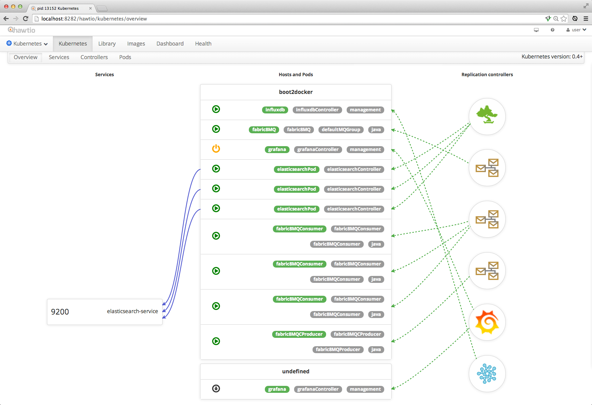
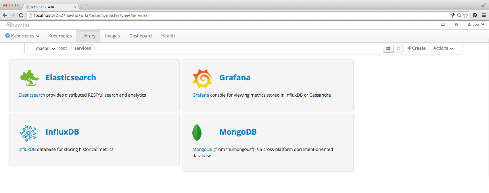

## Web Console

The Web Console is based on the [hawtio project](http://hawt.io/) and provides a rich HTML5 based web application for working with Kubernetes and the underlying containers reusing the various [hawtio plugins](http://hawt.io/plugins/index.html).

### Getting Started

The console has a number of tabs that let you look around Kubernetes. We'll highlight the main ones you 'll need to use:

#### Controllers

The main tab to get a feel for whats running in your system is the **Controllers** tab which shows all the [replication controllers](replicationControllers.html).

To scale up or down a controller to run more or less [pods](pods.html) (containers) just increase or decrease the **Desired Replicas** value and hit **Save** and hey presto pods are created or destroyed.

#### Overview

The **Overview** tab gives you a feel for how all the various [services](services.html) and  [replication controllers](replicationControllers.html) interact:

#### Library

The **Library** tab lets you drag and drop [Apps](apps.html) into your library from downloaded [App Zips](appzip.md) so that you can see all the available applications you can run. Click on an app then hit **Run** to run them.

You can also drag folder from the Library to your desktop and local file system to save them.

### Using Jube

If you are using Jube then the web console should be visible at [http://localhost:8585/hawtio/](http://localhost:8585/hawtio/). You can then view these tabs:

 * [Pods tab](http://localhost:8585/hawtio/kubernetes/pods) views all the available [pods](pods.html) in your kubernetes environment
 * [Replication Controllers tab](http://localhost:8585/hawtio/kubernetes/replicationControllers) views all the available [replication controllers](replicationControllers.html) in your kubernetes environment
 * [Services tab](http://localhost:8585/hawtio/kubernetes/services) views all the available [services](services.html) in your kubernetes environment

### Using Kubernetes/OpenShift

If you are using Kubernetes or OpenShift you need to find the URL that the web console is running. From there you should be able to navigate to the tabs for [pods](pods.html), [replication controllers] and [services](services.html)

